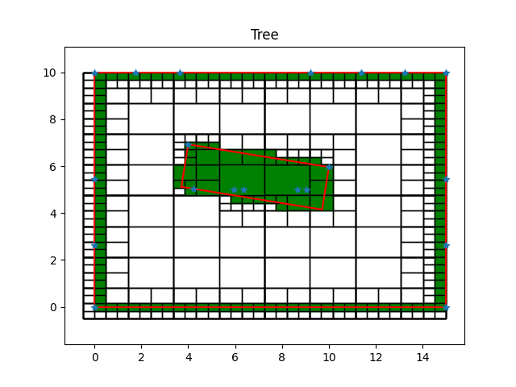
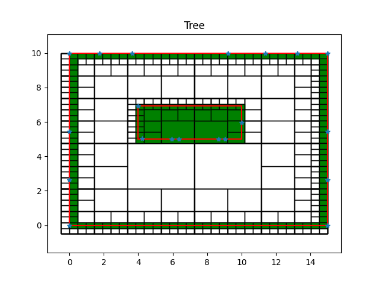

# Generate Occupancy Grid Map
## Source Code Details

The source code contains occupany grid mapping from sample data points as given in the PDF document.

The source code follows the work flow:

1. Initial data points are converted to X-Y coordinate system for generating occupancy grid map.

1. The outer bounding box is obtained based on the laser data.

1. Points near the outer boundary are filtered out based on the distance from the boundary.

1. With inner laser data, a KMeans clustering is used to cluster the data to number of objects. In the current case, one.

1. Based on the number of objects clustered, a bounding box is obtained for each cluster. The bounding box is obtained based on either minimum and maximum values of the data or minimum area rectangle fit of the cluster of data.

1. Occupany grid map is generated based on quadtree maps to reduce memory. Finer data points are generated for increasing resolution of occupancy grid map.

---

## Results:

| |  |
|---|---|
|Minimum Area Rectangle Fit | Regular Rectangle Fit |
|   Object 1:   |   Object 1:   |
| Center: (6.85, 5.54) | Center: (7.00, 5.96) |
| Dimension (m): Width: 1.84   Length: 6.08 | Dimension (m): Width: 6.00 Length: 1.93 |
| Orientation (deg): 80.82 | Orientation (deg): 0.00 |

## Extension To Unstructured Environment

For unstructured environment, finer resolution laser sensors or lidar sensors are required for accurate mapping. Resolution depends on the expected size of the objects in the environment.
### **Clustering**
The current source code works for multiple objects in a scene since KMeans clustering is used. Each object is bounded by a bounding box which is calculated with either minimum area fit or using extrema. The bounding box depends on the resolution of the points. As in the previous case, the bounding box is tilted since that is the minimum area rectangle for the data. Regular rectangle fit may not correctly define the bounds of an object which is at an angle.

In a more dynamic and unstructured environments, generic polygon fit i.e. convex hull can be used for different shaped objects for more generalisation. Using convex hull will have issues in concave objects in the scene. For this issue, using the point cloud data and generating a quadtree map will solve since, grid map will mark cells occupied only based on the data rather from bounding polygons. Tree branches itself will form sort of bounding boxes for various shaped objects.

In clustering, WCSS (within-cluster sum of squares) can be used to find optimum number of objects in the scene. For more sophistication in 3D, feature detection or object detection with corresponding camera images can be used for clustering objects.

### **Occupancy Grid Map**
The occupancy grid map is constructed with quadtree which is memory efficient compared to matrix grid. Matrix grid memory highly depends on resolution. If the map has to accommodate both small and large objects, then the grid size is determined by the smallest object. Large part of grid cells corresponding to large object will still exist even if the fine resolution is redundant. Further, planning algorithms may require to identify the status of cells for planning. For an unstructured environment, identifying free maneuverable space required finding occupied status of nearby cells which can have higher computational cost.

For unstructured environments, tree based occupany grid map is useful since any shape of the object can be accommodated using voxels and size of the object does not introduce memory constraints. In the problem solution, it can be seen that the object when encompassing a significant area, merges the inner branches in quadtree map, thus reducing redundant grid cells within large objects. Any concave object can be accommodated with the grid map and used for planning algorithms. For planning algorithms, it will be computationally less costly for identifying unoccupied maneuverable space based on the sizes of tree cells and their children.

For dynamic environments, probability based occupancy grid map can be used to update the occupancy status of the grid cells based on the changes in the environment. For 3D occupancy grid map, Octree can be used for occupancy grid map. It has similar advantages to quadtree, but for 3D.

